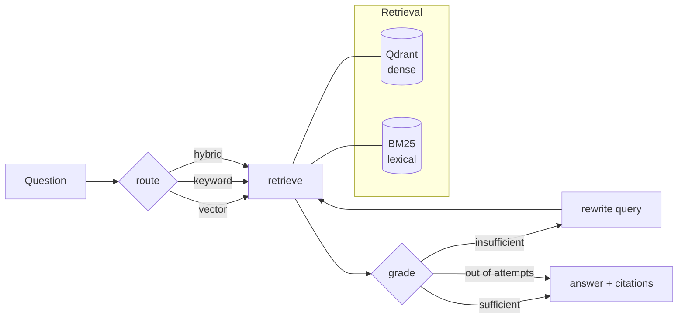

# Anchor

Agentic retrieval over arXiv where every claim is anchored to a source paper.

A LangGraph agent routes each question across a hybrid retriever (dense + BM25),
grades what came back, and re-queries when the evidence is thin. When the corpus
genuinely doesn't cover a question it says so instead of guessing — and the eval
set measures how often it gets that right.

> **Status:** Day 1 of 3. The retrieval graph and API are working; the eval
> harness (Day 2) and the entity-resolution layer (Day 3) are not built yet.
> Numbers will be filled in once the eval set exists — nothing below is
> estimated or aspirational.

## Architecture



The `grade → rewrite → retrieve` loop is the part that makes this agentic rather
than a fixed pipeline: the model decides whether its own retrieval was good
enough, and gets a bounded number of second chances.

**Why hybrid.** Dense search handles "what work is there on agent memory". It is
poor at exact tokens — an arXiv id, a surname, a model name like `GLiNER`. BM25
covers those. The router picks per question; `hybrid` is the fallback when it's
unsure.

## Quickstart

```bash
python -m venv .venv && .venv\Scripts\activate     # Windows
pip install -r requirements.txt

copy .env.example .env                             # then add your API key

python -m anchor.ingest.arxiv_fetch --limit 200    # fetch corpus
python -m anchor.index.build                       # embed + index
python -m anchor.cli "What work is there on agent memory?" --trace
```

Or serve it:

```bash
uvicorn anchor.api.app:app --reload
# POST /query {"question": "..."}
```

## Configuration

Everything is env-driven (`.env.example` documents each key).

| Variable | Default | Notes |
|---|---|---|
| `ANCHOR_LLM_PROVIDER` | `anthropic` | `anthropic` · `openai` · `ollama` |
| `ANCHOR_LLM_MODEL` | provider default | `claude-opus-5` for Anthropic |
| `ANCHOR_QDRANT_URL` | *(empty)* | Empty = embedded local file, no Docker |
| `ANCHOR_TOP_K` | `6` | Passages per retriever |
| `ANCHOR_MAX_GRADER_RETRIES` | `2` | Bounds the rewrite loop |

Runs fully offline with `ANCHOR_LLM_PROVIDER=ollama` — no API key, nothing
leaves the machine.

### A note on the Claude models

`claude-opus-5` (and the Claude 5 family generally) **removed the sampling
parameters** — sending `temperature`, `top_p` or `top_k` returns a 400. So
`anchor/llm.py` applies `temperature` only to the OpenAI and Ollama backends.
Thinking is on by default on that model; behaviour is steered by prompt rather
than by sampling.

## Layout

```
anchor/
  config.py          env-driven settings
  llm.py             provider-agnostic chat model factory
  ingest/            arXiv fetch -> corpus.jsonl
  index/             vector (Qdrant) + keyword (BM25) retrieval
  agent/             LangGraph state machine
  api/               FastAPI service
evals/               golden set + scoring        (Day 2)
```

## Roadmap

- **Day 2** — 50-question golden set including unanswerable questions; RAGAS
  scoring across three architectures (naive vector → +hybrid → +grader loop);
  Langfuse tracing; `docker compose up`.
- **Day 3** — author-name disambiguation with Splink, loaded into a Kùzu graph,
  exposed as a fourth `graph_traverse` retriever. arXiv author strings are
  genuinely inconsistent ("Y. Zhang" / "Yang Zhang" / "Zhang, Y."), which makes
  this a real entity-resolution problem rather than a toy one — and the eval
  gets re-run with and without it to measure what resolution is worth.

## License

MIT
