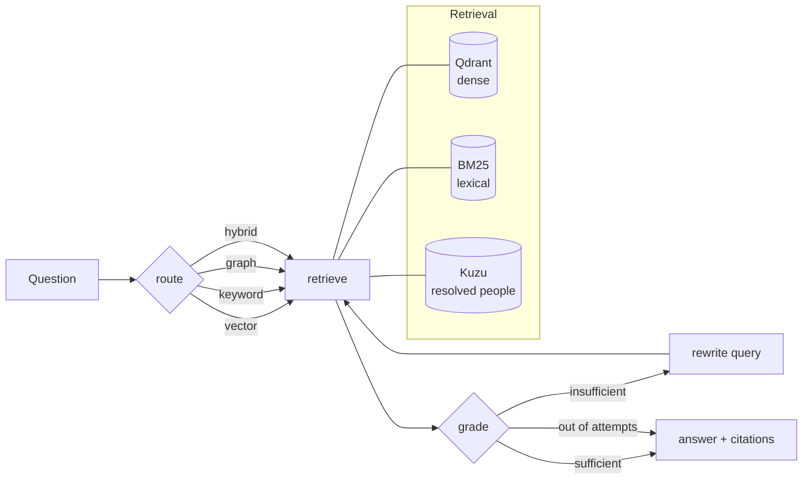

# Anchor

Agentic retrieval over arXiv where every claim is anchored to a source paper.

A LangGraph agent routes each question across a hybrid retriever (dense + BM25),
grades what came back, and re-queries when the evidence is thin. When the corpus
genuinely doesn't cover a question it says so instead of guessing — and the eval
set measures how often it gets that right.

> **No number in this README is typed by hand.** The results table is generated
> from `evals/results.jsonl` by `evals/report_markdown.py`, and every claim
> about the corpus is checked by a script that fails loudly when it stops being
> true. Where something is a heuristic or a known limitation, it says so.

## Architecture



The `grade → rewrite → retrieve` loop is what makes this agentic rather than a
fixed pipeline: the model decides whether its own retrieval was good enough and
gets a bounded number of second chances. On this backend it is also the part
that does not pay for itself — see the results.

**Why three retrievers.** Dense search handles *"what work is there on agent
memory"*. It is poor at exact tokens — an arXiv id, a model name like `GLiNER` —
which is BM25's job. Neither can answer *"what else has this author written"*,
because both match a **name string**: ask either for Wei Zhang and you get seven
different researchers' work returned as one person's. The graph traverses
resolved people instead. Measured effect on author questions: **0.286 → 0.964**.

## Quickstart

```bash
python -m venv .venv && .venv\Scripts\activate      # Windows
pip install -r requirements.txt
copy .env.example .env                              # then set a provider + key

python -m anchor.ingest.arxiv_fetch --limit 2000    # fetch corpus
python -m anchor.index.build                        # embed + index

python -m anchor.entities.resolve                   # resolve author mentions
python -m anchor.entities.graph                     # load the entity graph

python -m scripts.status                            # everything present?
python -m anchor.cli "What work is there on agent memory?" --trace
```

Or serve it:

```bash
uvicorn anchor.api.app:app --reload
# POST /query {"question": "..."}
```

## Configuration

Everything is env-driven (`.env.example` documents each key).

| Variable | Default | Notes |
|---|---|---|
| `ANCHOR_LLM_PROVIDER` | `anthropic` | `anthropic` · `openai` · `openrouter` · `ollama` |
| `ANCHOR_LLM_MODEL` | provider default | `claude-opus-5` · `openai/gpt-oss-20b:free` · `qwen2.5:3b` |
| `ANCHOR_LLM_BASE_URL` | *(empty)* | For OpenAI-compatible gateways |
| `ANCHOR_QDRANT_URL` | *(empty)* | Empty = embedded local file, no Docker |
| `ANCHOR_TOP_K` | `6` | Passages per retriever |
| `ANCHOR_MAX_GRADER_RETRIES` | `2` | Bounds the rewrite loop |
| `ANCHOR_ENABLE_GRAPH_ROUTE` | `true` | Off = architecture C, on = D |

Runs fully offline with `ANCHOR_LLM_PROVIDER=ollama` — no API key, nothing
leaves the machine. That is how the published results were produced.

## Results

<!-- RESULTS:START -->
| | Architecture | n | recall@k | refusal acc | correct refusals | false refusals | unsupported cites | calls | p50 s |
|---|---|---:|---:|---:|---:|---:|---:|---:|---:|
| **A** | `naive_vector` | 50 | 0.635 | 0.880 | 7/10 | 3/40 | 5 | 1.000 | 6.700 |
| **B** | `hybrid` | 50 | 0.815 | 0.880 | 4/10 | 0/40 | 1 | 1.000 | 14.800 |
| **C** | `agentic` | 50 | 0.680 | 0.800 | 5/10 | 5/40 | 2 | 3.980 | 24.800 |
| **D** | `agentic+graph` | 50 | 0.753 | 0.880 | 8/10 | 4/40 | 3 | 3.920 | 22.800 |

`recall@k` is measured only on questions with ground-truth ids. `refusal acc` is answering when answerable and refusing when not. `unsupported cites` counts citations to papers that were never retrieved.

**Recall / refusal accuracy by question type** (recall where ground truth exists, refusal accuracy for unanswerables):

| Question type | A `naive_vector` | B `hybrid` | C `agentic` | D `agentic+graph` |
|---|---:|---:|---:|---:|
| `aggregate` | 1.000 | 1.000 | 1.000 | 1.000 |
| `author` | 0.000 | 0.786 | 0.286 | 0.964 |
| `exact_id` | 0.000 | 0.600 | 0.400 | 0.200 |
| `multi_hop` | 0.438 | 0.500 | 0.500 | 0.500 |
| `single_hop` | 1.000 | 1.000 | 0.900 | 0.950 |
| `unanswerable` | 0.700 | 0.400 | 0.500 | 0.800 |

_Generated by `python -m evals.report_markdown` from 200 saved runs._
<!-- RESULTS:END -->

The table above is generated by `python -m evals.report_markdown --write`, not
typed. A hand-edited results table drifts from the data it reports and the
drift is invisible.

### What the numbers say

**Entity resolution is the one unambiguous win.** On author questions, C scores
0.286 and D scores 0.964 — the same agent, differing only in whether the
resolved-person graph is reachable. That is the single largest effect anywhere
in the table, and it lands exactly where the layer was built to land. Name
matching cannot separate seven researchers called Wei Zhang; traversing
resolved people can.

**The agentic loop does not pay for itself here.** Plain hybrid retrieval (B)
has the best overall recall at 0.815, beating both agentic architectures while
using **one model call instead of four** and half the latency. The grader loop
costs 4× the calls and *reduces* recall. It is not close.

**The loop actively hurts honesty in one configuration.** C has the worst
refusal accuracy in the table (0.800) and the most false refusals (5 of 40) —
it talks itself out of answers it had the evidence for. This is the 3B grader:
on one question it rewrote the query to *"the impact of climate change on polar
bear populations"*, which appears nowhere in the corpus or the question.

**Recall and honesty pull apart.** B has the best recall (0.815) and the *worst*
correct-refusal rate (4 of 10) — it retrieves well and then answers anyway. D
has the best refusal behaviour (8 of 10) at slightly lower recall. If wrong
answers are cheap, take B. If a confident wrong answer is the expensive failure
— which is the premise of this whole project — take D.

**The simplest architecture hallucinates least.** Unsupported citations:
A=5, B=1, C=2, D=3. Naive dense retrieval cites papers it never retrieved five
times; hybrid does it once.

### What these numbers are not

- **`exact_id` differences are noise.** There are 5 such questions, so one
  question is 0.2. C scores 0.400 and D 0.200 on a single question where the
  router picked `vector` over `keyword`. No exact-id question routed to the
  graph in either architecture — this is router variance, not a graph effect.
- **The backend penalises the architectures under test.** The sweep runs on a
  local 3B model, chosen because the free API tier caps at 50 calls/day and this
  needs ~500. The agentic architectures are precisely the ones that depend on
  the model grading its own retrieval, so C and D are handicapped in a way A and
  B are not. A stronger grader is a `.env` change; the conclusion "the loop
  doesn't pay" is specific to this backend and should not be generalised.
- **Refusal accuracy rests on a keyword heuristic** — calibrated below rather
  than assumed.
- **`recall@k` has a ceiling.** q34 has 7 relevant papers against `top_k=6`, so
  its maximum is 0.857 regardless of retrieval quality. It caps every
  architecture identically.

### Is the refusal metric trustworthy?

Refusal accuracy is the headline honesty number and it is produced by a regex,
so it was checked rather than trusted. 60 answers were sampled (stratified,
since unanswerable questions are only a fifth of the set), hand-labelled, and
compared with the heuristic:

| | |
|---|---|
| Raw agreement | 0.917 |
| **Cohen's κ** | **0.832** |
| Precision | 1.000 |
| Recall | 0.828 |
| Confusion | tp=24 fp=0 fn=5 tn=31 |

κ rather than raw agreement because one class dominates, and raw agreement
flatters a rater that simply guesses the majority. At 0.83 the agreement is
substantial, so the refusal numbers above can be read as meaningful.

**The error is one-directional, which matters more than its size.** Precision
is 1.000 — the heuristic never calls something a refusal that a human would
not. All five misses are refusals phrased in ways the patterns don't cover:

> *"there are no papers authored by Wei Zhang in this corpus"*
> *"None of the provided papers directly discuss Byzantine fault tolerance"*
> *"The papers do not provide any specific information about…"*

So **every refusal count in the results table is a lower bound**, and the true
correct-refusal rates are somewhat higher than reported. Nothing in the table
overstates how honest the system is.

Reproduce with:

```bash
python -m evals.calibrate_refusal --export   # writes a sample to label
python -m evals.calibrate_refusal --score    # kappa + the disagreements
```

## Evaluation

Four architectures are scored on the same 50-question golden set, so the
comparison isolates retrieval and control flow rather than prompt wording:

| | Architecture | Retrieval | Control flow |
|---|---|---|---|
| **A** | `naive_vector` | dense only | answer directly |
| **B** | `hybrid` | dense + BM25 | answer directly |
| **C** | `agentic` | routed | grade, rewrite, retry |
| **D** | `agentic+graph` | routed, **incl. resolved-entity graph** | grade, rewrite, retry |

**C vs D is the entity-resolution experiment.** Identical agent; the only
difference is whether the resolved-person graph is a route the router can
reach. The route is removed from the prompt entirely when disabled, so the
comparison measures retrieval rather than wording.

```bash
python -m evals.validate_golden_set     # check ground truth against the corpus
python -m evals.run_eval --max-calls 45 # a day's worth on a free tier
python -m evals.run_eval --report-only  # re-print from saved results
```

### The golden set

50 questions, every one grounded in the actual corpus: 20 single-hop, 8
multi-hop, 5 exact-id, 4 author, 3 aggregate, and **10 unanswerable**.

The unanswerable questions are the point. Most are near-misses rather than
obvious out-of-domain questions — asking about sparse autoencoders when the
corpus contains a *different* interpretability paper is a far harder test than
asking about the Roman Empire, because retrieval will confidently return
adjacent material.

`validate_golden_set.py` checks the ground truth mechanically: every
`expected_ids` entry must exist, and every unanswerable question's deciding
term must appear **zero** times in the corpus. This is not ceremony — it caught
a question asking about Mamba-style models on long context that the corpus
does in fact answer (`2607.21535v1` evaluates a mamba2-hybrid at 1M context).
Scored as written, it would have silently corrupted the refusal metric.

### Methodology notes

- **Metrics are deterministic.** No LLM judge, so results are reproducible and
  free to recompute. Refusal detection is a keyword heuristic and is flagged as
  such (`refusal_is_heuristic`) rather than quietly trusted — calibrating it
  against hand labels is the honest next step.
- **Model calls are measured, not inferred.** Counting them from the graph
  shape undercounts: a structured call that fails to parse silently costs a
  second request, which is exactly the overhead the agentic path should be
  charged for.
- **Latency is median and p95, never mean.** One hung free-tier request took
  11,588s and dragged the mean of 15 runs to 789s against a ~15s typical run.
- **A citation only counts as supported if that paper was retrieved.**
  Anything else is the model citing from memory — the failure the whole design
  exists to prevent.
- **The sweep is resumable**, and only *successful* runs count as done, so a
  rate-limited question is retried rather than silently skipped.

## Layout

```
anchor/
  config.py          env-driven settings
  llm.py             provider-agnostic chat model factory
  ingest/            arXiv fetch -> corpus.jsonl
  index/             vector (Qdrant) + keyword (BM25) retrieval
  agent/             LangGraph state machine
  api/               FastAPI service
  entities/          author resolution: mentions -> Splink -> Kuzu graph
  structured.py      schema-coerced output that survives a model ignoring it
  telemetry.py       measured model-call counter
evals/
  golden_set.jsonl       50 questions with ground truth
  validate_golden_set.py ground-truth checks against the corpus
  architectures.py       the four pipelines under comparison
  metrics.py             deterministic scoring
  run_eval.py            resumable sweep + report
  report_markdown.py     generates the README results table
scripts/
  status.py              one-shot consistency check
  run_eval_daily.cmd     scheduled-task entry point
tests/
  preflight_llm.py       can this backend do structured output at all?
  smoke_*.py             retrieval, graph wiring, entity graph, route toggle
```

Every check runs without an LLM except `preflight_llm.py`:

```bash
python -m scripts.status              # is everything present and consistent?
python -m tests.smoke_retrieval       # both retrievers, plus arXiv-id lookup
python -m tests.smoke_graph           # graph wiring and retry policy
python -m tests.smoke_graph_search    # entity graph vs name matching
python -m tests.smoke_route_toggle    # C and D really do differ
python -m evals.validate_golden_set   # ground truth still holds
```

## Entity resolution

Author questions are where name matching quietly fails. Ask BM25 for papers by
*Gian Luca Pozzato* and it returns 8 papers, of which 2 are his — the rest match
on common tokens. Ask it for *Wei Zhang* and it returns one author's
bibliography, when the corpus contains **seven different researchers with that
name**.

So mentions are resolved into people before the graph is built:

```bash
python -m anchor.entities.survey          # how much resolution is needed?
python -m anchor.entities.resolve         # Splink -> resolved_authors.jsonl
python -m anchor.entities.threshold_sweep # pick the threshold from evidence
python -m anchor.entities.graph           # load Kuzu: (:Person)-[:AUTHORED]->(:Paper)
python -m anchor.entities.analyse         # what changed vs matching on name
```

| | |
|---|---|
| Author mentions | 10,244 |
| Distinct name strings (baseline) | 9,289 |
| **Resolved people** | **9,922** |
| Names split into >1 person | 558 |
| Clusters spanning >1 surname | 0 |

Resolution yields *more* entities than name matching, not fewer — the work is
mostly in refusing to merge, not in merging.

### What went wrong on the way

Worth recording, because each failure was only visible through a check:

- **The first model over-merged catastrophically.** Nine researchers —
  `hwalsuk lee`, `hwaran lee`, `hyeonju lee`, … — became one person. Cause:
  co-authors were compared with Levenshtein over a joined string, where
  `"chen li wang"` and `"chen lin wang"` differ by one character while naming
  different people. Fixed with set intersection over full co-author names.
- **The second model merged nothing at all** — 10,244 mentions, 10,244 people.
  Splink reported `first_name: m values not fully trained`; the EM blocking
  rule held `first_name` constant while also comparing it, so its weights were
  never learned.
- **Then the maximum match probability across 408,730 pairs was 0.035.** Two
  causes: co-authors stored as bare surnames (sharing "wang" is nearly no
  evidence) and no term-frequency adjustment, so agreeing on `wei` counted the
  same as agreeing on `hwalsuk`. Fixing both moved the maximum to 0.98.
- **The graph retriever matched names by substring**, so "Wei Zhang" also
  matched "Xinwei Zhang" and reported 3 people sharing the name instead of 7.

The threshold is chosen by `threshold_sweep.py` rather than asserted: across
0.80–0.98 the number of clusters spanning two surnames stays at zero, so a high
threshold buys nothing but lost recall.

**Known limitation:** blocking on exact surname plus a TF-adjusted name
comparison means the model never joins *different* name strings — `Y. Zhang`
and `Yang Zhang` stay separate. It does the hard job (splitting same-name
different-people) well and the easy one not at all.

## Backend notes

Written against Claude, OpenAI, OpenRouter and Ollama, and actually run on
three of them. The eval reported above runs on **Ollama with `qwen2.5:3b`**,
locally and offline — chosen because OpenRouter's free tier caps at 50 requests
a day and the sweep needs roughly 500.

That choice has a cost worth stating plainly: a 3B model is a weak grader. On
one question it rewrote the query to *"the impact of climate change on polar
bear populations"*, which has nothing to do with anything in the corpus. The
architecture comparison is therefore partly a measurement of the model, and the
agentic architectures are the ones that suffer for it — they are the ones that
depend on the model judging its own retrieval. Re-running against a stronger
backend is a `.env` change and nothing else.

Three things worth knowing if you swap the backend:

- **Structured output is not portable.** `gpt-oss-20b` on OpenRouter's free
  tier has no tool-calling provider online (503 `model_unavailable`) and
  ignores `json_schema` often enough to break a router — it answered the
  routing prompt with `**vector**`. So `anchor/structured.py` asks for JSON in
  the prompt, parses tolerantly, retries once, and falls back to a documented
  default per node. A flaky router degrades the answer; it never kills the
  request, and it marks itself `[FALLBACK]` in the trace.
- **Claude 5 rejects sampling parameters.** `temperature`, `top_p` and `top_k`
  were removed and return a 400, so `anchor/llm.py` applies temperature only to
  the OpenAI-compatible and Ollama backends.
- **Small models emit routes that do not exist.** `qwen2.5:3b` answered the
  routing prompt with `"retrieval"`, which is not one of the options. Every
  route is validated against the set the retriever actually implements and
  falls back to `hybrid`, so an invented route costs a little recall instead of
  raising an exception.

Run `python -m tests.preflight_llm` after switching. It checks the key, the
quota, and — the part that usually breaks — whether the backend can return
structured output at all.

## Roadmap

- **Calibrate the refusal heuristic.** Refusal detection is currently keyword
  matching. Hand-labelling ~100 answers and reporting judge–human agreement
  (Cohen's κ) would make the honesty metric measured rather than asserted. It
  is the weakest link in the numbers above and is flagged as such in the code.
- **Re-run against a stronger backend.** The published sweep uses a local 3B
  model because it was the only way to run ~500 calls without a quota. The
  agentic architectures are the ones penalised by a weak grader, so the
  comparison is not yet a fair test of them. `.env` change, nothing else.
- **Join abbreviated names.** Resolution splits same-name-different-people well
  and never joins different name strings, so `Y. Zhang` and `Yang Zhang` remain
  separate people. Blocking on surname plus a phonetic key would address it.
- **Span-level provenance.** Citations currently point at a paper. Pointing at
  the sentence within it is the difference between "traceable" and "verifiable".

## License

MIT
