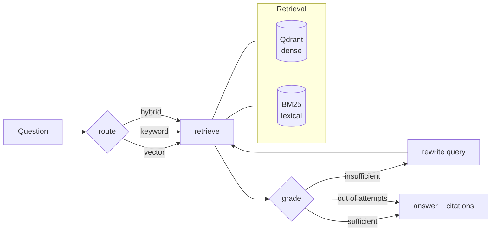

# Anchor

Agentic retrieval over arXiv where every claim is anchored to a source paper.

A LangGraph agent routes each question across a hybrid retriever (dense + BM25),
grades what came back, and re-queries when the evidence is thin. When the corpus
genuinely doesn't cover a question it says so instead of guessing — and the eval
set measures how often it gets that right.

> **Status:** graph, API and eval harness are built and running. The full
> architecture comparison is still being collected — the backend is a free tier
> capped at 50 requests/day and the sweep needs ~300, so it completes over
> several days. **No number appears in this README until it has actually been
> measured.** Partial results live in `evals/results.jsonl`.

## Architecture



The `grade → rewrite → retrieve` loop is the part that makes this agentic rather
than a fixed pipeline: the model decides whether its own retrieval was good
enough, and gets a bounded number of second chances.

**Why hybrid.** Dense search handles "what work is there on agent memory". It is
poor at exact tokens — an arXiv id, a surname, a model name like `GLiNER`. BM25
covers those. The router picks per question; `hybrid` is the fallback when it's
unsure.

## Quickstart

```bash
python -m venv .venv && .venv\Scripts\activate     # Windows
pip install -r requirements.txt

copy .env.example .env                             # then add your API key

python -m anchor.ingest.arxiv_fetch --limit 200    # fetch corpus
python -m anchor.index.build                       # embed + index
python -m anchor.cli "What work is there on agent memory?" --trace
```

Or serve it:

```bash
uvicorn anchor.api.app:app --reload
# POST /query {"question": "..."}
```

## Configuration

Everything is env-driven (`.env.example` documents each key).

| Variable | Default | Notes |
|---|---|---|
| `ANCHOR_LLM_PROVIDER` | `anthropic` | `anthropic` · `openai` · `ollama` |
| `ANCHOR_LLM_MODEL` | provider default | `claude-opus-5` for Anthropic |
| `ANCHOR_QDRANT_URL` | *(empty)* | Empty = embedded local file, no Docker |
| `ANCHOR_TOP_K` | `6` | Passages per retriever |
| `ANCHOR_MAX_GRADER_RETRIES` | `2` | Bounds the rewrite loop |

Runs fully offline with `ANCHOR_LLM_PROVIDER=ollama` — no API key, nothing
leaves the machine.

### A note on the Claude models

`claude-opus-5` (and the Claude 5 family generally) **removed the sampling
parameters** — sending `temperature`, `top_p` or `top_k` returns a 400. So
`anchor/llm.py` applies `temperature` only to the OpenAI and Ollama backends.
Thinking is on by default on that model; behaviour is steered by prompt rather
than by sampling.

## Evaluation

Three architectures are scored on the same 50-question golden set, so the
comparison isolates retrieval and control flow rather than prompt wording:

| | Architecture | Retrieval | Control flow |
|---|---|---|---|
| **A** | `naive_vector` | dense only | answer directly |
| **B** | `hybrid` | dense + BM25 | answer directly |
| **C** | `agentic` | routed | grade, rewrite, retry |

```bash
python -m evals.validate_golden_set     # check ground truth against the corpus
python -m evals.run_eval --max-calls 45 # a day's worth on a free tier
python -m evals.run_eval --report-only  # re-print from saved results
```

### The golden set

50 questions, every one grounded in the actual corpus: 20 single-hop, 8
multi-hop, 5 exact-id, 4 author, 3 aggregate, and **10 unanswerable**.

The unanswerable questions are the point. Most are near-misses rather than
obvious out-of-domain questions — asking about sparse autoencoders when the
corpus contains a *different* interpretability paper is a far harder test than
asking about the Roman Empire, because retrieval will confidently return
adjacent material.

`validate_golden_set.py` checks the ground truth mechanically: every
`expected_ids` entry must exist, and every unanswerable question's deciding
term must appear **zero** times in the corpus. This is not ceremony — it caught
a question asking about Mamba-style models on long context that the corpus
does in fact answer (`2607.21535v1` evaluates a mamba2-hybrid at 1M context).
Scored as written, it would have silently corrupted the refusal metric.

### Methodology notes

- **Metrics are deterministic.** No LLM judge, so results are reproducible and
  free to recompute. Refusal detection is a keyword heuristic and is flagged as
  such (`refusal_is_heuristic`) rather than quietly trusted — calibrating it
  against hand labels is the honest next step.
- **Model calls are measured, not inferred.** Counting them from the graph
  shape undercounts: a structured call that fails to parse silently costs a
  second request, which is exactly the overhead the agentic path should be
  charged for.
- **Latency is median and p95, never mean.** One hung free-tier request took
  11,588s and dragged the mean of 15 runs to 789s against a ~15s typical run.
- **A citation only counts as supported if that paper was retrieved.**
  Anything else is the model citing from memory — the failure the whole design
  exists to prevent.
- **The sweep is resumable**, and only *successful* runs count as done, so a
  rate-limited question is retried rather than silently skipped.

## Layout

```
anchor/
  config.py          env-driven settings
  llm.py             provider-agnostic chat model factory
  ingest/            arXiv fetch -> corpus.jsonl
  index/             vector (Qdrant) + keyword (BM25) retrieval
  agent/             LangGraph state machine
  api/               FastAPI service
  structured.py      schema-coerced output that survives a model ignoring it
  telemetry.py       measured model-call counter
evals/
  golden_set.jsonl       50 questions with ground truth
  validate_golden_set.py ground-truth checks against the corpus
  architectures.py       the three pipelines under comparison
  metrics.py             deterministic scoring
  run_eval.py            resumable sweep + report
```

## Backend notes

Written against Claude, OpenAI, OpenRouter and Ollama. Two things worth knowing
if you swap the backend:

- **Structured output is not portable.** `gpt-oss-20b` on OpenRouter's free
  tier has no tool-calling provider online (503 `model_unavailable`) and
  ignores `json_schema` often enough to break a router — it answered the
  routing prompt with `**vector**`. So `anchor/structured.py` asks for JSON in
  the prompt, parses tolerantly, retries once, and falls back to a documented
  default per node. A flaky router degrades the answer; it never kills the
  request, and it marks itself `[FALLBACK]` in the trace.
- **Claude 5 rejects sampling parameters.** `temperature`, `top_p` and `top_k`
  were removed and return a 400, so `anchor/llm.py` applies temperature only to
  the OpenAI-compatible and Ollama backends.

## Roadmap

- **Now** — finish collecting the architecture comparison (free-tier quota
  limits the sweep to ~50 model calls/day), then publish the results table.
- **Next** — calibrate the refusal heuristic against hand labels and report
  judge–human agreement, so the honesty metric is measured rather than assumed.
- **Then** — author-name disambiguation with Splink, loaded into a Kùzu graph,
  exposed as a fourth `graph_traverse` retriever. arXiv author strings are
  genuinely inconsistent ("Y. Zhang" / "Yang Zhang" / "Zhang, Y."), which makes
  this a real entity-resolution problem rather than a toy one — and the eval
  gets re-run with and without it to measure what resolution is worth.

## License

MIT
